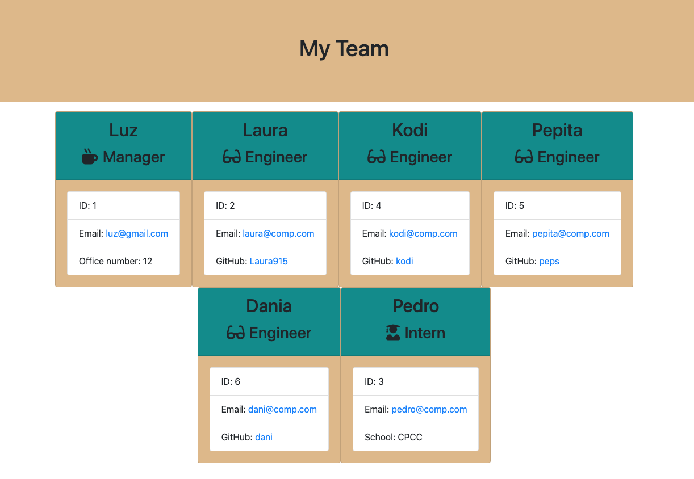

# Team-Generator

 ### [Team-Generator Demo !](https://youtu.be/sPTlVrgFAl8)

 ## Description 
  A command line app that enables the user to organize team members' information. 
    
 **User Story:** <br>
    As a team leader or manager <br>
    I want to output a webpage that presents my team's basic information <br>
    so that I have quick access to emails and GitHub profiles
  
  [](output/img/team-generator-screenShot.png)

  ## Table of Contents

  * [Usage](#usage)
  
  * [Installation](#installation)

  * [Build](#Build)

  * [Tests](#test)

  * [Questions](#questions)

  ## Usage
  User will be prompted with a series of questions to build their team. 
  1. Managers infomation: name, id, email, and officeNumber
  2. Next User will be prompted to input as many memebers as needed. Members include :<br>
    - Intern: name, id, email and school <br>
    - Engineer: name, id, email and github<br>
  
  After all the team members' information is submitted, a team.html page will render data in a responsive webpage.<br>

  To begin using, run the following command:

  ```node app.js```

  ## Installation
  To install required dependencies, run the following command:

  ```npm i```
  
  ## Build
  **Tools Used :**  JavaScript Node.js Inquirer Jest HTML CSS

  **Process** </br>

  **Work Flow:**</br>
  1. Given test written with [jest](https://jestjs.io/), ran code  
  2. Created or update classes to pass a single test case
  3. Repeat

  **OOP Paradigm:** </br>
  OOP(Object-Oriented Programming) is a programming pattern centered on the idea of “objects”. These objects can contain data, in the form of attributes or methods. </br>

  Abstraction</br>
  Created an employee class which contains common employee data, such as name, id, and email. This class is exported to serve as the model, or parent, for all other employee classes needed and created.

  Inheritance and Polymorphism</br>
  Because the Engineer, intern, and manager classes share common functionality, they each inherit the employee class. 
  Inheritance enables the creations of pure methods by avoiding code duplication. Polymorphism permits us to edit each instance with different methods and props.  

  ## Test
  To run test, run the following command:
  
  ```npm run test```
  
  ## Questions
  If you have a question about this repo, open a issue or contact Laura915
